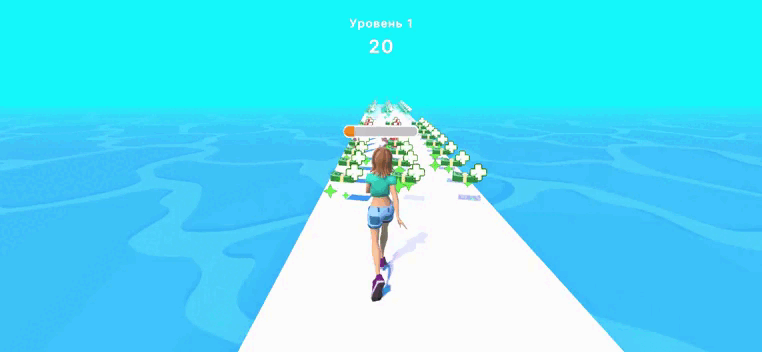

# Rich-Man-3D-Test-Task

**Rich-Man-3D-Test-Task** is a test assignment that implements a set of basic mechanics for a 3D game. The project includes interaction with game objects, character control, UI elements, and other functional features, which were used to demonstrate skills in Unity development.

This assignment serves as a test to assess the ability to work with various aspects of game development and Unity, including movement implementation, interfaces, and object interactions.

The project was developed as part of a test task and is not the final version of the game.

## Author

Developer: **Betoraf**

